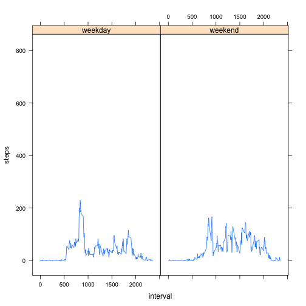

## Loading and preprocessing the data


```r
rm(list = ls ())
activity = read.csv(file = unz("activity.zip", "activity.csv"))
activity$date = as.Date(activity$date)
```


## What is mean total number of steps taken per day?


```r
step_number_that_day = sapply(X = split(x = activity$steps, f = activity$date, drop = FALSE), FUN = sum, na.rm = FALSE)
hist(step_number_that_day , main = "Histogram of number of step on a given day",
     xlab = "Number of step on a given day", ylab = "Count")
```

 

```r
ratio_mean_over_median = mean(step_number_that_day , na.rm = TRUE) / median(step_number_that_day ,na.rm = TRUE)
```

When it comes to the number of steps on a given day, the mean to median ratio is ``1.0001104``.  

## What is the average daily activity pattern?


```r
interval_mean_step = sapply(X = split(x = activity$steps, f = activity$interval, drop = FALSE),
                            FUN = mean, na.rm = TRUE)
plot(interval_mean_step,type = "l", 
     main = "Average number of step on a given interval",
     xlab = "Interval", 
     ylab = "Average number of steps")
```

 


## Imputing missing values
There are 2304 incomplete rows.

```r
table(complete.cases(activity))
```

```
## 
## FALSE  TRUE 
##  2304 15264
```

A missing value for a given interval is substituted with the average value on that given interval, missing value excluded. Results are kept in a new data set.


```r
activity_imputed = activity
activity_imputed$steps = ifelse(test = is.na(activity$steps),
                        yes = interval_mean_step[as.character(activity$interval)],
                        no = activity$steps)
```

Let us make a histogram of the total number of steps taken each day accoring to the new data set.


```r
step_number_that_day_imputed = sapply(X = split(x = activity_imputed$steps, f = activity_imputed$date, drop = FALSE),
                                      FUN = sum,
                                      na.rm = FALSE)
hist(step_number_that_day_imputed , main = "Histogram of number of step on a given day after imputation",
     xlab = "Number of step on a given day", ylab = "Count")
```

 

```r
ratio_mean_over_median_imputed = mean(step_number_that_day_imputed , na.rm = TRUE) / median(step_number_that_day_imputed ,na.rm = TRUE)
```

When it comes to the number of steps on a given day, the mean to median ratio is ``1.0001104`` without imputation and ``1`` after. They differ.

## Are there differences in activity patterns between weekdays and weekends?

Let us distinguish between the weekdays and the weekend and plot the average number of steps for each interval.


```r
activity_imputed$week_part = factor(ifelse(test = weekdays(activity_imputed$date) %in% c("Saturday","Sunday"),
                                           yes = "weekend",
                                           no = "weekday")
                                    )

library(lattice)
average_step_number_interval = function(x,y){ 
  f = split(x = y,f = unique(x))
  f = sapply(X = f,FUN = mean,na.rm = TRUE)
  f[as.character(unique(x))]
}
xyplot(x = steps ~ interval | week_part ,data = activity_imputed, 
       panel = function(x,y,...){
         panel.xyplot(unique(x),average_step_number_interval(x,y), type = "l")
         }
       )
```

 
